---
## Front matter
lang: ru-RU
title: Лабораторная работа №1
subtitle: Работа с Git
author:
  - Гузева И.Н..
institute:
  - Российский университет дружбы народов, Москва, Россия

## i18n babel
babel-lang: russian
babel-otherlangs: english

## Formatting pdf
toc: false
toc-title: Содержание
slide_level: 2
aspectratio: 169
section-titles: true
theme: metropolis
header-includes:
 - \metroset{progressbar=frametitle,sectionpage=progressbar,numbering=fraction}
 - '\makeatletter'
 - '\beamer@ignorenonframefalse'
 - '\makeatother'
---

# Информация

## Докладчик

:::::::::::::: {.columns align=center}
::: {.column width="70%"}

  * Гузева Ирина Николаевна
  * студентка НФИбд-01-22
  * Российский университет дружбы народов

:::

:::
::::::::::::::


## Цель работы

Приобрести практические навыки работы с системой управления версиями Git.

## Задания


1. Создать репозиторий

2. Изменить его содержимое, изучить работу с коммитами, версиями и тегами

3. Поработать с объектами Git

4. Создать дополнительную ветку, провести слияние, разрешение конфликтов

5. Создать клон репозитория и слить его с оригинальным

6. Залить и извлечь изменения

# Выполнение лабораторной работы

## Подготовка

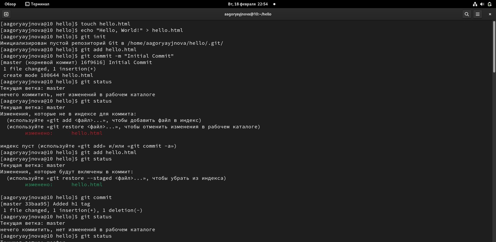{#fig:001 width=70%}

## Внесение изменений

Изменим содержимое файла hello.html на:

```
<h1>Hello, World!</h1>
```

## Внесение изменений

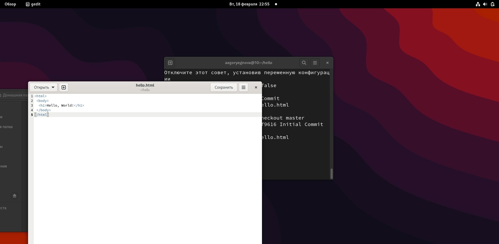{#fig:002 width=70%}

## История

Получим список произведённыз изменений в станлартном виде, затем в однострочном, а также с указанием времени и количества.


## Получение старых версий

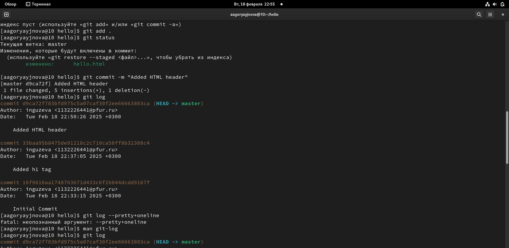{#fig:003 width=70%}

## Создание тегов версий

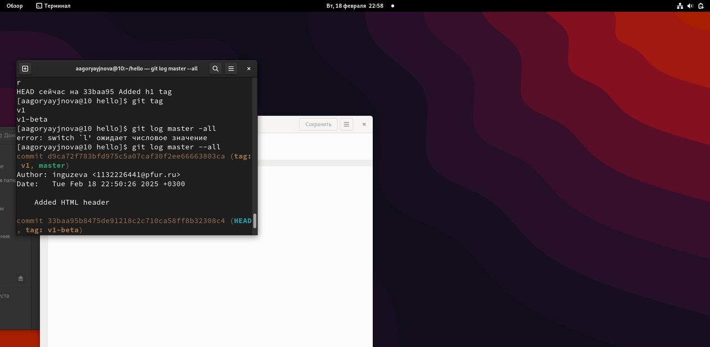{#fig:004 width=70%}

## Добавления нежелательного комментария

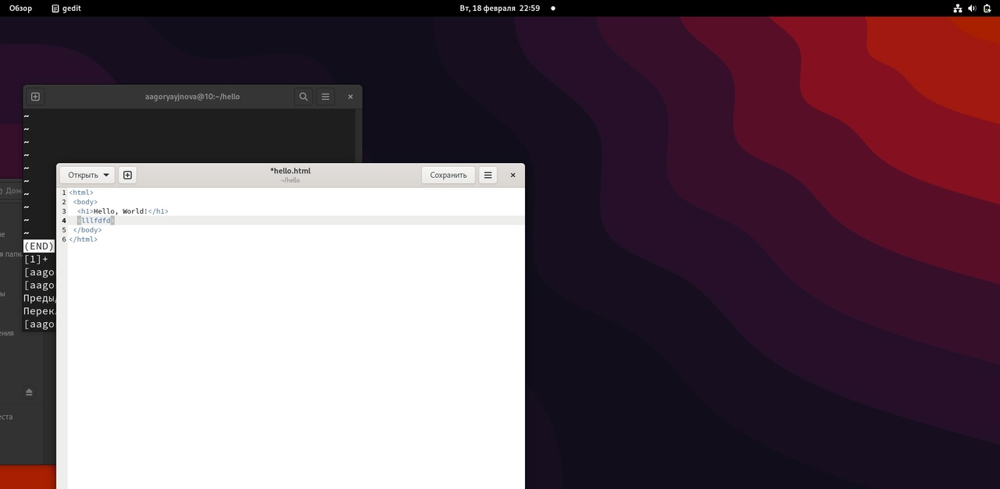{#fig:005 width=70%}

## Отмена проиндексированных изменений (перед коммитом)

 Используем команду git reset, чтобы сбросить буферную зону к HEAD. Это очищает буферную зону от изменений, которые мы только что проиндексировали.
 
## Отмена коммитов

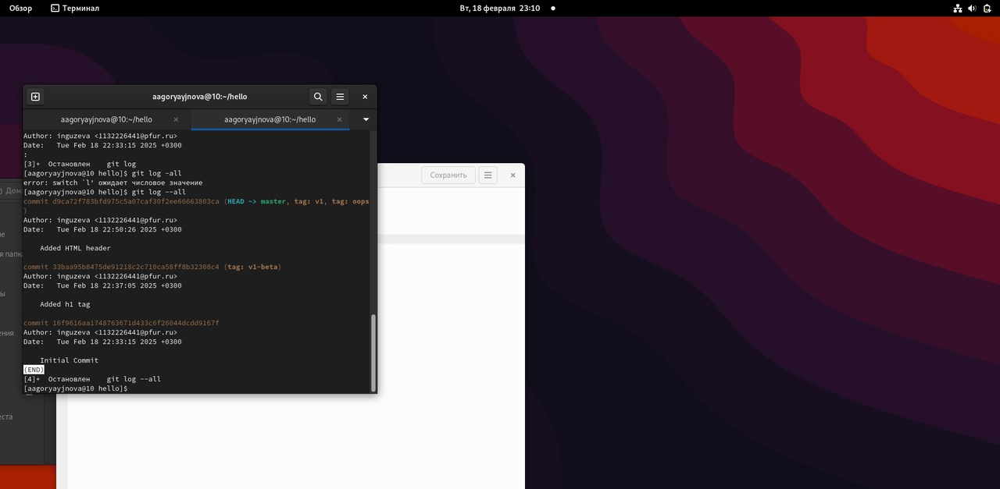{#fig:006 width=70%}

## Удаление коммиттов из ветки

Удалим последние два коммита с помощью сброса, сначала отметим последний коммит тегом, чтобы его можно было потом найти. Используем команду git reset, чтобы вернуться к версии до этих коммитов.

## Удаление тега oops

Удалим тег oops и коммиты, на которые он ссылался, сборщиком мусора. Теперь этот тег не отображается в репозитории.

## Изменение предыдущего коммита

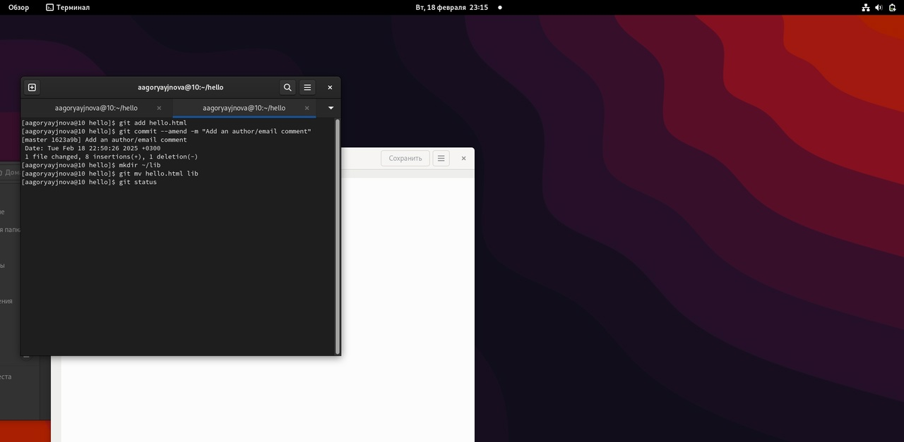{#fig:007 width=70%}

## Перемещение файлов

Переместим наш файл в каталог lib. Для этого создадим его и используем команду git mv, сделаем коммит этого пермещения.

## Добавим файл index.html в наш репозиторий

```
<html>
  <body>
    <iframe src="lib/hello.html" width="200" height="200" />
  </body>
</html>
```

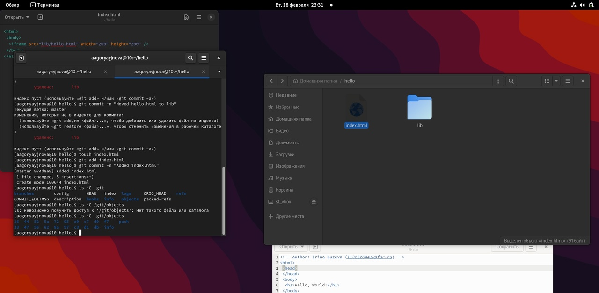{#fig:008 width=70%}

## Git внутри: Каталог .git

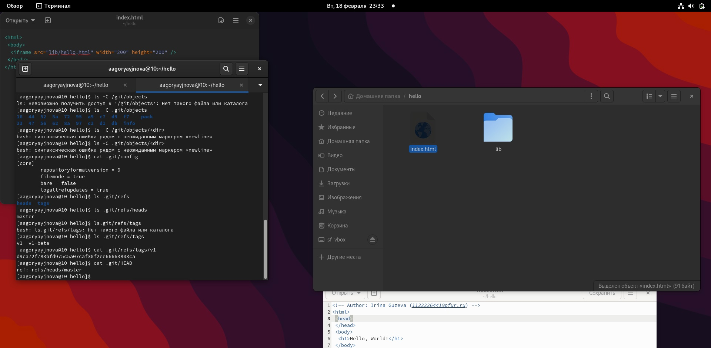{#fig:009 width=70%}

## Работа непосредственно с объектами git

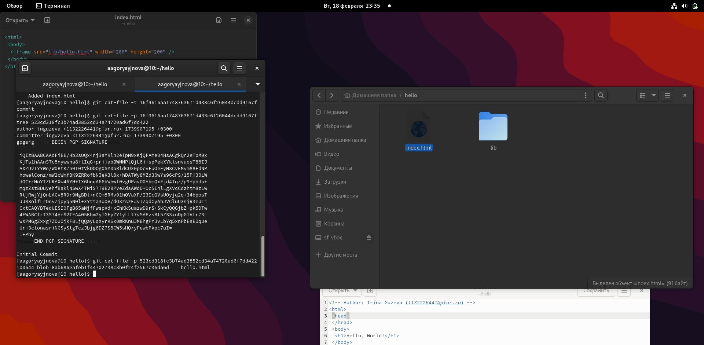{#fig:010 width=70%}

## Создание ветки

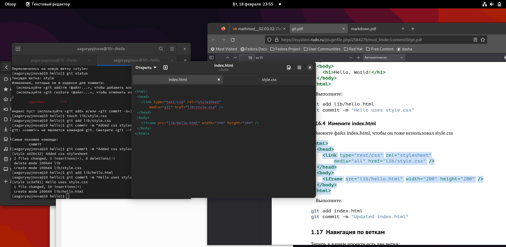{#fig:011 width=70%}

## Навигация по веткам

Посмотрим все логи.
Переключимся обратно на основную ветку и просмотрим содержимое файла ib/hello.html, заметим, что он не использует стили, также просмотрим содержимое этого файла в новой ветке.

## Изменения в ветке master

Вернемся в основную ветку и добавим файл  README.md. Просмотрим ветки и их различия.

## Слияние

Слияние переносит изменения из двух веток в одну. Вернемся к ветке style и сольем master с style.

## Создание конфликта

После коммита «Added README» ветка master была объединена с веткой style, но в настоящее время в master есть дополнительный коммит, который не был слит с style. Последнее изменение в master конфликтует с некоторыми изменениями в style.

## Разрешение конфликтов

Вернемся к ветке style и попытаемся объединить ее с новой веткой
master. Внесем изменения в lib/hello.html, оставив только необходимую нам запись и добавим этот файл в репозиторий, чтобы вручную разрешить конфликт.

## Сброс ветки style

Вернемся на ветке style к точке перед тем, как мы слили ее с веткой master. Мы видим, что коммит «Updated index.html» был последним на ветке style перед слиянием. Сбросим ветку style к этому коммиту.

## Сброс ветки master

Коммит «Added README» идет непосредственно перед коммитом конфликтующего интерактивного режима. Мы сбросим ветку master к коммиту «Added README».

## Слияние в ветку master
 
Вернемся в ветку master и сольем ветку style в неё с помощью команды git merge.

## Клонирование репозиториев

Перейдем в наш рабочий каталог и сделаем клон репозитория hello, затем создадим клон репозитория. Просмотрев его увидим список всех файлов на верхнем уровне оригинального репозитория README.md, index.html и lib.

## Что такое origin?

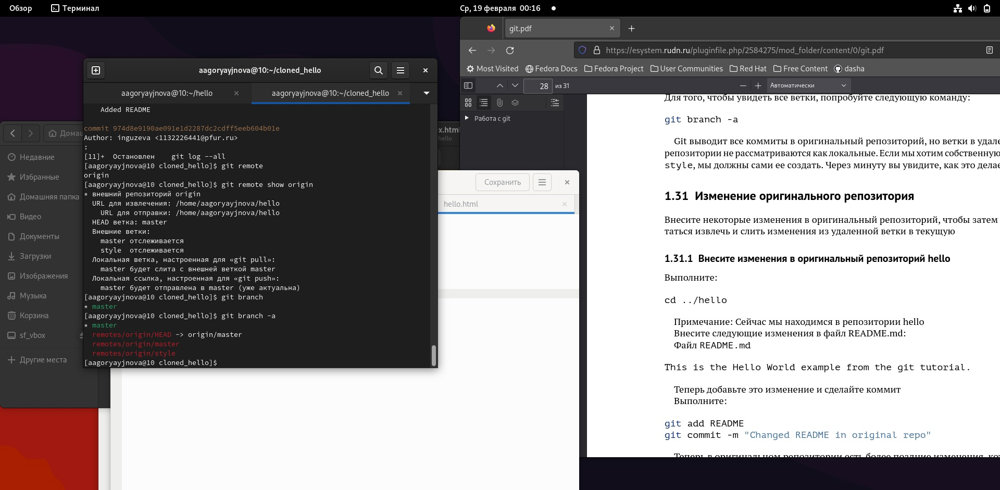{#fig:012 width=70%}

## Удаленные ветки

Посмотрим на ветки, доступные в нашем клонированном репозитории. Можно увидеть, что в списке только ветка master.

## Изменение оригинального репозитория

Перейдём в клон репозитория и используем команду git fetch, которая будет извлекать новые коммиты из удаленного репозитория, но не будет сливать их с наработками в локальных ветках.

## Слияние извлеченных изменений

Сольем внесённые изменения в главную ветку. Также можно было бы использовать команду git pull, которая является объединением fetch и merge в одну команду.

## Добавление ветки наблюдения

Добавим локальную ветку, которая отслеживает удаленную ветку, теперь мы можем видеть ветку style в списке веток и логе.

## Создание чистого репозитория

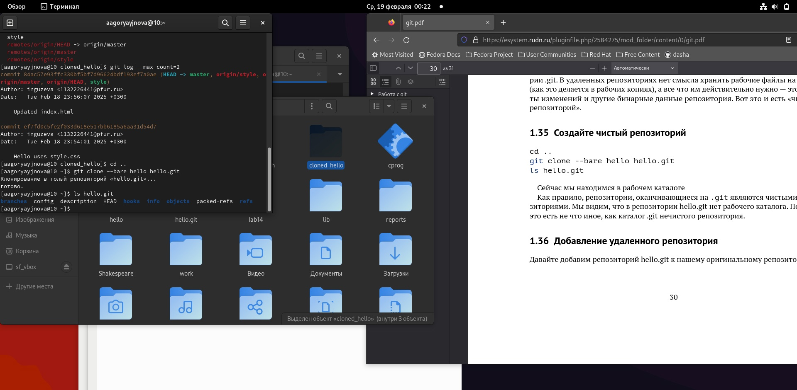{#fig:013 width=70%}

## Отправка и извлечение изменений 

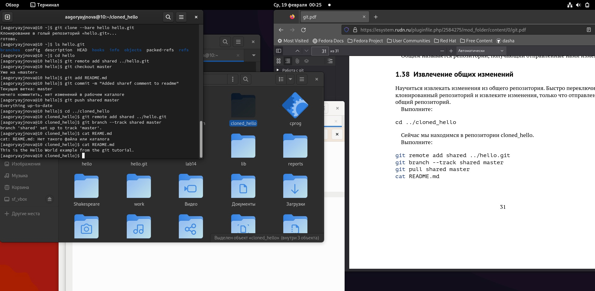{#fig:014 width=70%}


# Выводы

В процессе выполнения данной лабораторной работы я приобрела практические навыки работы с Git.
