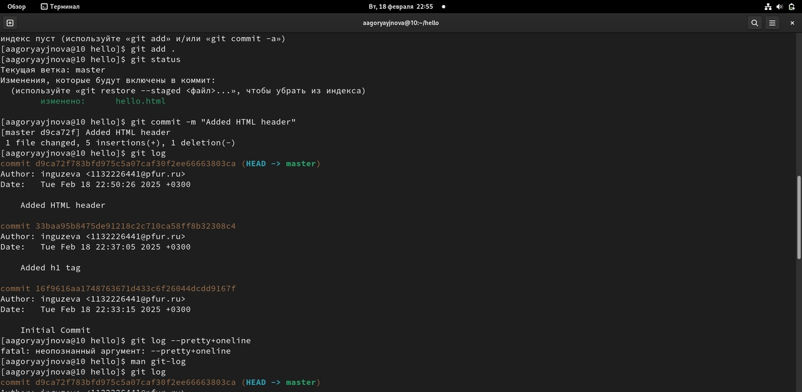
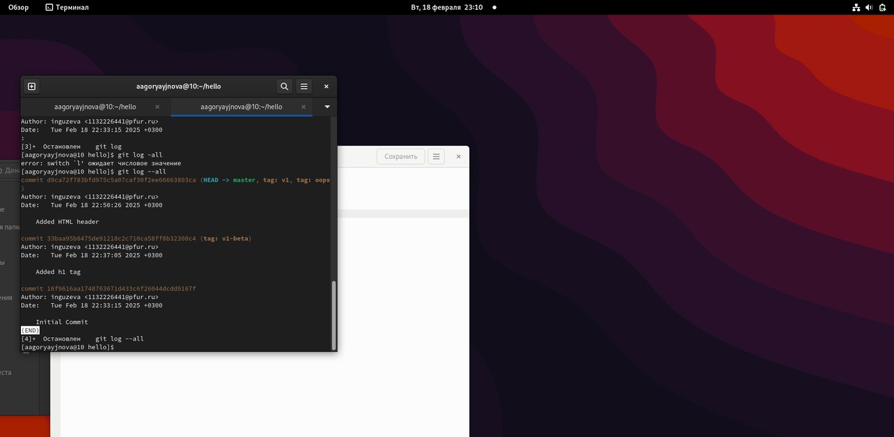
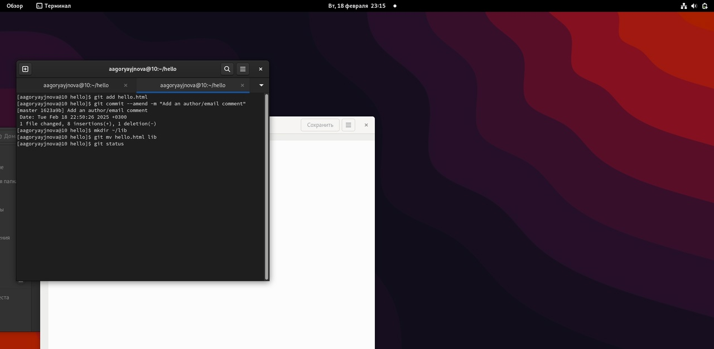
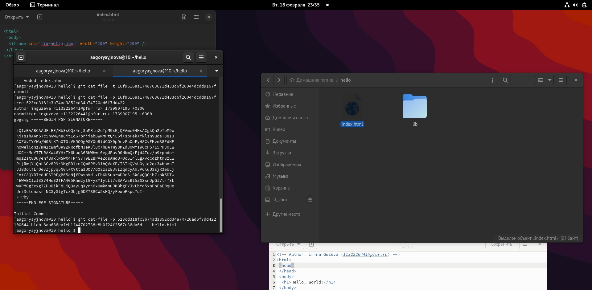
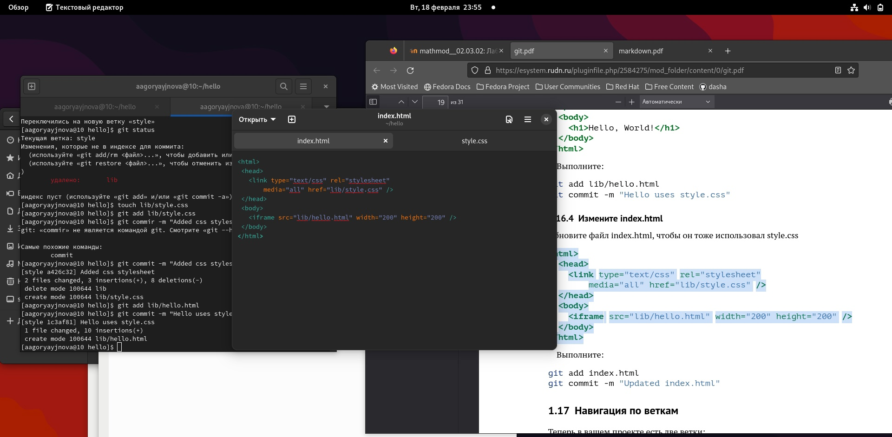
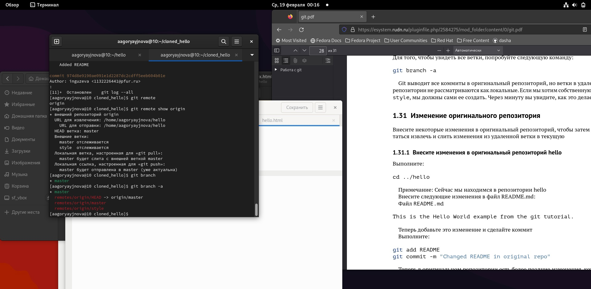
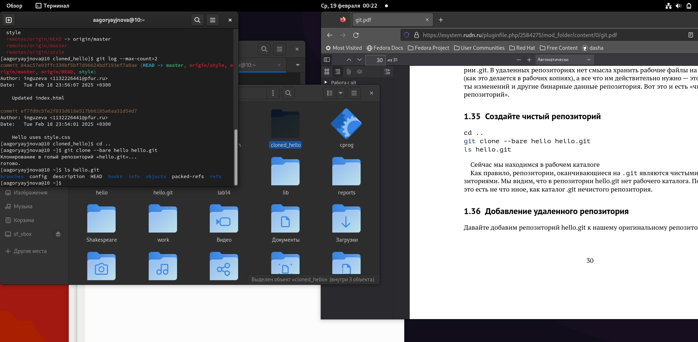
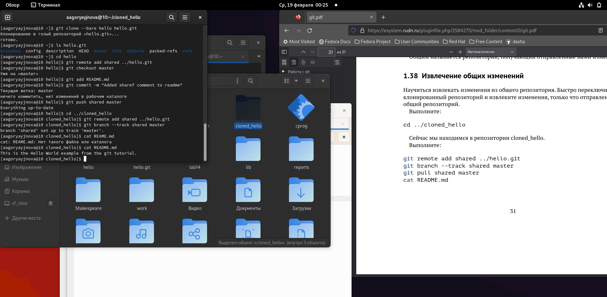

---
## Front matter
title: "Лабораторная работа №1"
subtitle: "Работа с git"
author: "Гузева Ирина Николаевна"

## Generic otions
lang: ru-RU
toc-title: "Содержание"

## Bibliography
bibliography: bib/cite.bib
csl: pandoc/csl/gost-r-7-0-5-2008-numeric.csl

## Pdf output format
toc: true # Table of contents
toc-depth: 2
lof: true # List of figures
lot: false # List of tables
fontsize: 12pt
linestretch: 1.5
papersize: a4
documentclass: scrreprt
## I18n polyglossia
polyglossia-lang:
  name: russian
  options:
	- spelling=modern
	- babelshorthands=true
polyglossia-otherlangs:
  name: english
## I18n babel
babel-lang: russian
babel-otherlangs: english
## Fonts
mainfont: PT Serif
romanfont: PT Serif
sansfont: PT Sans
monofont: PT Mono
mainfontoptions: Ligatures=TeX
romanfontoptions: Ligatures=TeX
sansfontoptions: Ligatures=TeX,Scale=MatchLowercase
monofontoptions: Scale=MatchLowercase,Scale=0.9
## Biblatex
biblatex: true
biblio-style: "gost-numeric"
biblatexoptions:
  - parentracker=true
  - backend=biber
  - hyperref=auto
  - language=auto
  - autolang=other*
  - citestyle=gost-numeric
## Pandoc-crossref LaTeX customization
figureTitle: "Рис."
tableTitle: "Таблица"
listingTitle: "Листинг"
lofTitle: "Список иллюстраций"
lotTitle: "Список таблиц"
lolTitle: "Листинги"
## Misc options
indent: true
header-includes:
  - \usepackage{indentfirst}
  - \usepackage{float} # keep figures where there are in the text
  - \floatplacement{figure}{H} # keep figures where there are in the text
---

# Цель работы

Приобрести практические навыки работы с системой управления версиями Git.

# Теоретическое введение

Git — распределённая система управления версиями. Проект был создан Линусом Торвальдсом для управления разработкой ядра Linux, первая версия выпущена 7 апреля 2005 года; координатор — Дзюн Хамано [@wiki:bash].

# Выполнение лабораторной работы

## Подготовка

Сначала настроим core.autocrlf с параметрами true и input, чтобы сделать все переводы строк текстовых файлов в главном репозитории одинаковыми, а затем настроим отображение unicode

## Создание проекта

Создадим пустой каталог hello, а в нём файл с именем hello.html. Затем создадим  git репозиторий из этого каталога, выполнив команду git init. Добавим файл в репозиторий и проверим статус, который сообщает, что коммитить нечего(рис. @fig:001).

{#fig:001 width=70%}


## Внесение изменений

Изменим содержимое файла hello.html на:

```
<h1>Hello, World!</h1>
```

Проверив состояние рабочего каталога увидим, что git знает, что файл hello.html был изменен, но при этом эти изменения еще не зафиксированы в репозитории. Теперь проиндексируем изменения и снова посмотрим статус, в нём указано, что изменения пока не записаны в резапозиторий. И наконец закоммитим изменения, внеся их в репозиторий и снова посмотрим статус, который теперь показывает, что все изменения внесены в репозиторий.

Изменим страницу «Hello, World», чтобы она содержала стандартные теги <html> и <body>.

```
<html>
  <body>
    <h1>Hello, World!</h1>
  </body>
</html>
```

Теперь добавим это изменение в индекс git и добавим заголовки HTML (секцию <head>) к странице «Hello, World» (рис. @fig:002). Проверив текущий статус увидим, что hello.html указан дважды в состоянии. Первое изменение (добавление стандартных тегов) проиндексировано и готово к коммиту. Второе изменение (добавление заголовков HTML) является непроиндексированным. Произведем коммит проиндексированного изменения, затем проиндексируем оставшееся изменение, посмотрим статус и прокоммитим его.

{#fig:002 width=70%}

## История

Получим список произведённыз изменений в станлартном виде, затем в однострочном, а также с указанием времени и количества.

## Получение старых версий

Изучим данные лога и найдем там хэш первого коммита, используя его вернемся к первой верссии и просмотрим файл hello.html, действительно, увидим первую версию. Затем вернемся к последней версии в ветке master и вновь посмотрим на файл(рис. @fig:003).

{#fig:003 width=70%}

## Создание тегов версий

Назовем текущую версию страницы hello первой (v1). Создадим тег первой версии и используем его для того чтобы венуться к предыдущей, которой также присвоим тег.

Переключимся по тегам между двумя отмеченными версиями. Просмотрим все доступные теги(их два) и посмотрим теги в логе(рис. @fig:004).

{#fig:004 width=70%}


## Отмена локальных изменений (до индексации)

Убдеимся, что мы находимся на последнем коммите ветки master и внесем изменение в файл hello.html в виде нежелательного комментария (рис. @fig:005).  Затем проверим статус, увидим, что изменения ещё не проиндексированы. Используем команду git checkout для переключения версии файла hello.html в репозитории.

{#fig:005 width=70%}

## Отмена проиндексированных изменений (перед коммитом)

Внесем изменение в файл hello.html в виде нежелательного комментария

```
<html>
  <head>
    <!-- This is an unwanted but staged comment -->
  </head>
  <body>
    <h1>Hello, World!</h1>
  </body>
</html>
```

Проиндексируем это изменение и проверим состояние. Состояние показывает, что изменение было проиндексировано и готово к коммиту. Используем команду git reset, чтобы сбросить буферную зону к HEAD. Это очищает буферную зону от изменений, которые мы только что проиндексировали. И переключимся на последнюю версию коммита, посмотрев статус увидим, что наш каталог опять чист.

## Отмена коммитов

Изменим файл hello.html на следующий.

```
<html>
  <head>
  </head>
  <body>
    <h1>Hello, World!</h1>
    <!-- This is an unwanted but committed change -->
  </body>
</html>
```

Проиндексируем изменения файла и прокоммитим их. Чтобы отменить коммит, нам необходимо сделать коммит, который удаляет изменения, сохраненные нежелательным коммитом. Перейдем в редактор, где изменим нежелательный коммит. Проверим лог. Проверка лога показывает нежелательные и отмененные коммиты в наш репозиторий(рис. @fig:006).

{#fig:006 width=70%}

## Удаление коммиттов из ветки

Удалим последние два коммита с помощью сброса, сначала отметим последний коммит тегом, чтобы его можно было потом найти. Используем команду git reset, чтобы вернуться к версии до этих коммитов. Теперь в логе их нет, но если посмотреть логи с опцией  --all можно всё ещё их увидеть, но метка HEAD находится на нужной нам версии.

## Удаление тега oops

Удалим тег oops и коммиты, на которые он ссылался, сборщиком мусора. Теперь этот тег не отображается в репозитории.

## Изменение предыдущего коммита

Добавим в страницу комментарий автора.

Затем добавим их в репозиторий. Теперь мы хотим добавить в комментарий автора почту, обноим страницу hello, включив в неё почту. Чтобы у нас остался один коммит, а не два, изменим последний с помощьб опции --amend, теперь в логах отображается последняя версия коммита(рис. @fig:007).

{#fig:007 width=70%}

## Перемещение файлов

Переместим наш файл в каталог lib. Для этого создадим его и используем команду git mv, сделаем коммит этого пермещения.

## Подробнее о структуре

Добавим файл index.html в наш репозиторий

```
<html>
  <body>
    <iframe src="lib/hello.html" width="200" height="200" />
  </body>
</html>
```

Добавим файл и сделаем коммит. (рис.@fig:008).

{#fig:008 width=70%}

Теперь при открытии index.html, увидим кусок страницы hello в маленьком окошке

## Git внутри: Каталог .git

Просмотрим каталог, в котором хранится вся информация git. Затем посмотрим набор каталогов, имена которых состоят из 2 символов. Имена каталогов являются первыми двумя буквами хэша sha1 объекта, хранящегося в git. Посмотрим в один из каталогов с именем из 2 букв. Увидим файлы с именами из 38 символов. Это файлы, содержащие объекты, хранящиеся в git. Посмотрим файл конфигурации, создающийся для каждого конкретного проекта. Затем посмотрим подкаталоги .git/refs/heads и .git/refs/tags, а также содержимое файла v1, в нём хранится хэш коммита, привязанный к тегу. Также посмотрим содержимоей файла HEAD, который содержит ссылку на текущую ветку, в данный момент это ветка master((рис. @fig:009).

{#fig:009 width=70%}

## Работа непосредственно с объектами git

Найдем последний коммит и выедем его с помощью  SHA1 хэша. Затем посмотрим дерево каталогов, ссылка на который идёт в последнем коммите, вывдем каталог lib и файл  hello.html(рис. @fig:010).

{#fig:010 width=70%}

Исследуем  git репозиторий вручную самостоятельно. Используя хэш родительского коммита последовательно дойдем до первой версии файла hello.html и посмотрим его.

## Создание ветки

Создадим новую ветку «style» и перейдем в неё. Добавим туда файл стилей style.css и добавим его в репозиторий. Обновим файл hello.html, чтобы использовать стили style.css и index.html, также обновим их в репозиторий(рис. @fig:011).

{#fig:011 width=70%}


## Навигация по веткам

Посмотрим все логи.
Переключимся обратно на основную ветку и просмотрим содержимое файла ib/hello.html, заметим, что он не использует стили, также просмотрим содержимое этого файла в новой ветке.

## Изменения в ветке master

Вернемся в основную ветку и добавим файл  README.md. Просмотрим ветки и их различия.

## Слияние

Слияние переносит изменения из двух веток в одну. Вернемся к ветке style и сольем master с style.

## Создание конфликта

Вернемся в ветку master и создадим конфликт, внеся изменения в файл hello.html. Просмотрим ветки. После коммита «Added README» ветка master была объединена с веткой style, но в настоящее время в master есть дополнительный коммит, который не был слит с style. Последнее изменение в master конфликтует с некоторыми изменениями в style.

## Разрешение конфликтов

Вернемся к ветке style и попытаемся объединить ее с новой веткой
master. В файле lib/hello.html можно увидеть записи с обеих версий этого файла. Первый раздел — версия текущей ветки (style). Второй раздел — версия ветки master.  Внесем изменения в lib/hello.html, оставив только необходимую нам запись и добавим этот файл в репозиторий, чтобы вручную разрешить конфликт.

## Сброс ветки style

Вернемся на ветке style к точке перед тем, как мы слили ее с веткой master. Мы хотим вернуться в ветке style в точку перед слиянием с master. Нам необходимо найти последний коммит перед слиянием.

Мы видим, что коммит «Updated index.html» был последним на ветке style перед слиянием. Сбросим ветку style к этому коммиту.

Поищим лог ветки style. Увидим, что у нас в истории больше нет коммитов слияний.

## Сброс ветки master

Добавив интерактивный режим в ветку master, мы внесли изменения, конфликтующие с изменениями в ветке style. Давайте вернемся в ветке master в точку перед внесением конфликтующих изменений. Это позволяет нам продемонстрировать работу команды git rebase, не беспокоясь о конфликтах. Просмотрим коммиты ветки master.

Коммит «Added README» идет непосредственно перед коммитом конфликтующего интерактивного режима. Мы сбросим ветку master к коммиту «Added README».

## Перебазирование

Используем команду rebase вместо команды merge. Мы вернулись в точку до первого слияния и хотим перенести изменения из ветки master в нашу ветку style. На этот раз для переноса изменений из ветки master мы будем использовать команду git rebase вместо слияния.

## Слияние в ветку master
 
Вернемся в ветку master и сольем ветку style в неё с помощью команды git merge.

## Клонирование репозиториев

Перейдем в наш рабочий каталог и сделаем клон репозитория hello, затем создадим клон репозитория. Просмотрев его увидим список всех файлов на верхнем уровне оригинального репозитория README.md, index.html и lib. Затем просмотрим историю репозитория и увидим список всех коммитов в новый репозиторий, и он совпадает с историей коммитов в оригинальном репозитории. Единствен в названиях веток.

## Что такое origin?

Клонированный репозиторий знает об имени по умолчанию удаленного репозитория. Посмотрим, подробную информацию об имени по умолчанию.Для того, чтобы увидеть все ветки используем опцию -a(рис. @fig:012).

{#fig:012 width=70%}

## Удаленные ветки

Посмотрим на ветки, доступные в нашем клонированном репозитории. Можно увидеть, что в списке только ветка master.

## Изменение оригинального репозитория

Перейдем в репозиторий hello. Внесем изменения в файл README.md. Затем добавим их в репозиторий.
Перейдём в клон репозитория и используем команду git fetch, которая будет извлекать новые коммиты из удаленного репозитория, но не будет сливать их с наработками в локальных ветках.

## Слияние извлеченных изменений

Сольем внесённые изменения в главную ветку. Также можно было бы использовать команду git pull, которая является объединением fetch и merge в одну команду.

## Добавление ветки наблюдения

Добавим локальную ветку, которая отслеживает удаленную ветку, теперь мы можем видеть ветку style в списке веток и логе.

## Создание чистого репозитория

Как правило, репозитории, оканчивающиеся на .git являются чистыми репозиториями. Создадим такой в рабочем каталоге. Затем добавим репозиторий  hello.git к нашему оригинальному репозиторию(рис. @fig:013).

{#fig:013 width=70%}

## Отправка и извлечение изменений 

Так как чистые репозитории, как правило, расшариваются на каком-нибудь сетевом сервере, нам необходимо отправить наши изменения в другие репозитории. Начнем с создания изменения для отправки. Отредактируем файл README.md и сделаем коммит, затем отправим изменения в общий репозиторий. Затем извлечем изменения из общего репозитория(рис. @fig:014).


{#fig:014 width=70%}

# Выводы

В процессе выполнения данной лабораторной работы я приобрела практические навыки работы с Git.

# Список литературы{.unnumbered}

::: {#refs}
:::
