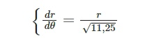
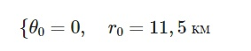
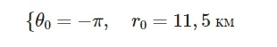
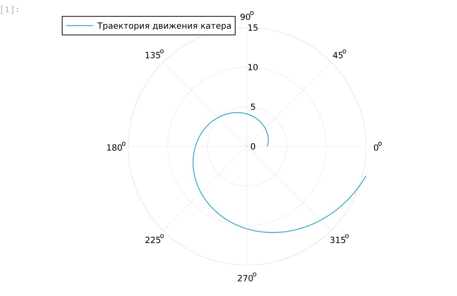
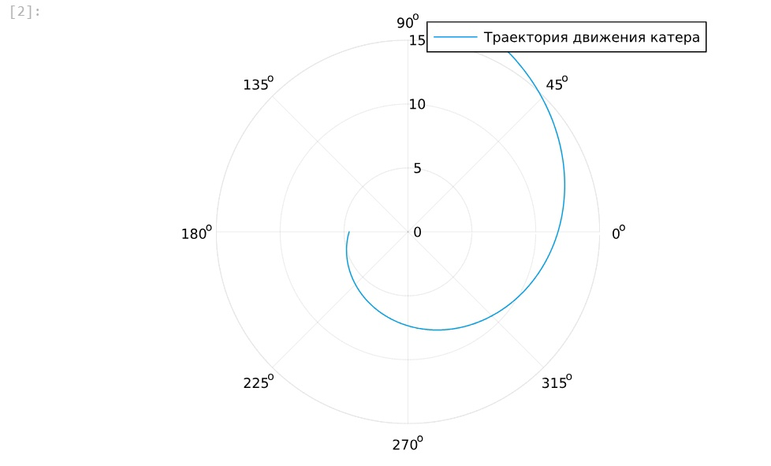

---
## Front matter
lang: ru-RU
title: Лаьораторная работа №2
subtitle: Задача о погоне
author:
  - Гузева Ирина Николаевна.
institute:
  - Российский университет дружбы народов, Москва, Россия
## i18n babel
babel-lang: russian
babel-otherlangs: english

## Formatting pdf
toc: false
toc-title: Содержание
slide_level: 2
aspectratio: 169
section-titles: true
theme: metropolis
header-includes:
 - \metroset{progressbar=frametitle,sectionpage=progressbar,numbering=fraction}
 - '\makeatletter'
 - '\beamer@ignorenonframefalse'
 - '\makeatother'
---

# Информация

## Докладчик

:::::::::::::: {.columns align=center}
::: {.column width="70%"}

  * Гузева Ирина Николаевна
  * студентка НФИбд-01-22
  * Российский университет дружбы народов
  * [1132226441@pfur.ru](mailto:1132226441@pfur.ru)
  * <https://inguzeva.github.io/ru/>

:::
::: {.column width="25%"}


## Цель работы

Построить математическую модель для выбора правильной стратегии при решении примера задаче о погоне.

## Задание

На море в тумане катер береговой охраны преследует лодку браконьеров.
Через определенный промежуток времени туман рассеивается, и лодка обнаруживается на расстоянии 11,5 км от катера. Затем лодка снова скрывается в тумане и уходит прямолинейно в неизвестном направлении. Известно, что скорость катера в 3,5 раза больше скорости браконьерской лодки.

## Задание

1. Записать уравнение, описывающее движение катера, с начальными условиями для двух случаев (в зависимости от расположения катера относительно лодки в начальный момент времени).

2. Построить траекторию движения катера и лодки для двух случаев.

3. Найти точку пересечения траектории катера и лодки 

## Выполнение лабораторной работы

Формула для выбора варианта: `(1132226441%70)+1` = 32 вариант.


## Случай 1: Катер находится на расстоянии 11,5 км от лодки в начальный момент времени.

Уравнение движения катера в полярных координатах (рис. [-@fig:003]):

{#fig:003 width=70%}


## Выполнение лабораторной работы
 

Исключая время \( t \), получаем (рис. [-@fig:004]):

{#fig:004 width=70%}


### Начальные условия

Начальные условия для 1 случая (рис. [-@fig:005]):

{#fig:005 width=70%}


## Случай 2: Катер находится на расстоянии 11,5 км от лодки, но в противоположном направлении.

Уравнение движения катера остается таким же, но начальные условия меняются (рис. [-@fig:006]):

{#fig:006 width=70%}


## Построение модели

```Julia
using DifferentialEquations, Plots

# Начальные условия для первого случая
r0 = 11.5 / 4.5
theta0 = (0.0, 2*pi)

# Функция, описывающая движение катера
f(r, p, t) = r / sqrt(11.25)
```
## Построение модели

```Julia
# Постановка задачи и решение
prob = ODEProblem(f, r0, theta0)
sol = solve(prob, saveat = 0.01)

# Построение траектории движения катера
plot(sol.t, sol.u, proj=:polar, lims=(0, 15), label = "Траектория движения катера")
```


## Построение модели

{#fig:001 width=70%}

## Построение модели

```Julia

# Начальные условия для второго случая
r0_2 = 11.5 / 2.5
theta0_2 = (-pi, pi)

# Постановка задачи и решение
prob_2 = ODEProblem(f, r0_2, theta0_2)
sol_2 = solve(prob_2, saveat = 0.01)

# Построение траектории движения катера
plot(sol_2.t, sol_2.u, proj=:polar, lims=(0, 15), label = "Траектория движения катера")
```


## Построение модели

{#fig:002 width=70%}


## Итоговые результаты

1. В первом случае катер перехватит лодку на расстоянии 6.532 км под углом 60 градусов (1.047 радиан).
2. Во втором случае катер перехватит лодку на расстоянии 9.798 км под углом 120 градусов (2.094 радиан).


## Выводы

В процессе выполнения данной лабораторной работы я построила математическую модель для выбора правильной стратегии при решении примера задаче о погоне.


## Список литературы

1. Кривая погони [Электронный ресурс]. URL: https://ru.wikipedia.org/wiki/Кривая_погони.
