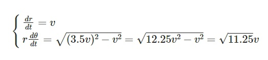
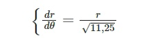
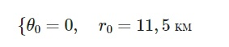
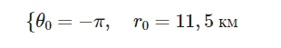
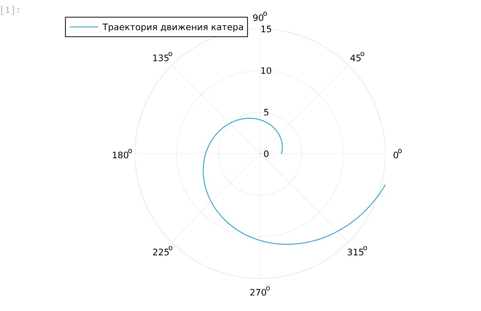
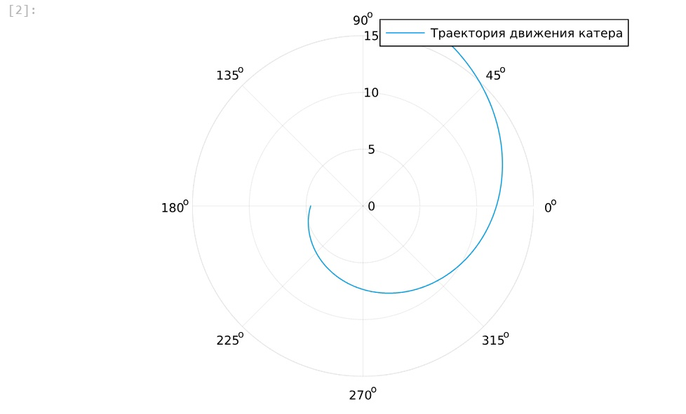

---
## Front matter
title: "Лабораторная работа №2"
subtitle: "Задача о погоне"
author: "Гузева Ирина Николаевна"

## Generic otions
lang: ru-RU
toc-title: "Содержание"

## Bibliography
bibliography: bib/cite.bib
csl: pandoc/csl/gost-r-7-0-5-2008-numeric.csl

## Pdf output format
toc: true # Table of contents
toc-depth: 2
lof: true # List of figures
lot: false # List of tables
fontsize: 12pt
linestretch: 1.5
papersize: a4
documentclass: scrreprt
## I18n polyglossia
polyglossia-lang:
  name: russian
  options:
	- spelling=modern
	- babelshorthands=true
polyglossia-otherlangs:
  name: english
## I18n babel
babel-lang: russian
babel-otherlangs: english
## Fonts
mainfont: PT Serif
romanfont: PT Serif
sansfont: PT Sans
monofont: PT Mono
mainfontoptions: Ligatures=TeX
romanfontoptions: Ligatures=TeX
sansfontoptions: Ligatures=TeX,Scale=MatchLowercase
monofontoptions: Scale=MatchLowercase,Scale=0.9
## Biblatex
biblatex: true
biblio-style: "gost-numeric"
biblatexoptions:
  - parentracker=true
  - backend=biber
  - hyperref=auto
  - language=auto
  - autolang=other*
  - citestyle=gost-numeric
## Pandoc-crossref LaTeX customization
figureTitle: "Рис."
tableTitle: "Таблица"
listingTitle: "Листинг"
lofTitle: "Список иллюстраций"
lotTitle: "Список таблиц"
lolTitle: "Листинги"
## Misc options
indent: true
header-includes:
  - \usepackage{indentfirst}
  - \usepackage{float} # keep figures where there are in the text
  - \floatplacement{figure}{H} # keep figures where there are in the text
---

# Цель работы

Построить математическую модель для выбора правильной стратегии при решении примера задаче о погоне.

# Задание

На море в тумане катер береговой охраны преследует лодку браконьеров.
Через определенный промежуток времени туман рассеивается, и лодка обнаруживается на расстоянии 11,5 км от катера. Затем лодка снова скрывается в тумане и уходит прямолинейно в неизвестном направлении. Известно, что скорость катера в 3,5 раза больше скорости браконьерской лодки.

1. Записать уравнение, описывающее движение катера, с начальными условиями для двух случаев (в зависимости от расположения катера относительно лодки в начальный момент времени).

2. Построить траекторию движения катера и лодки для двух случаев.

3. Найти точку пересечения траектории катера и лодки 

# Теоретическое введение

Кривая погони — кривая, представляющая собой решение задачи о «погоне», которая ставится следующим образом. Пусть точка A равномерно движется по некоторой заданной кривой. Требуется найти траекторию равномерного движения точки P такую, что касательная, проведённая к траектории в любой момент движения, проходила бы через соответствующее этому моменту положение точки A.

# Выполнение лабораторной работы

Формула для выбора варианта: `(1132226441%70)+1` = 32 вариант.

Запишем уравнение описывающее движение катера, с начальными условиями для двух случаев (в зависимости от расположения катера относительно лодки в начальный момент времени).

Принимем за $t_0 = 0$, $x_0 = 0$ -- место нахождения лодки браконьеров в момент обнаружения,$x_{k0} = k$ - место нахождения катера береговой охраны относительно лодки браконьеров в момент обнаружения лодки.

Введем полярные координаты. Считаем, что полюс - это точка обнаружения лодки браконьеров $x_{k0}$ ($\theta = x_{k0} = 0$), а полярная ось $r$ проходит через точку нахождения катера береговой охраны.

Траектория катера должна быть такой, чтобы и катер, и лодка все время были на одном расстоянии от полюса $\theta$ , только в этом случае траектория
катера пересечется с траекторией лодки. Поэтому для начала катер береговой охраны должен двигаться некоторое время прямолинейно, пока не окажется на том же расстоянии от полюса, что и лодка браконьеров. После этого катер береговой охраны должен двигаться вокруг полюса удаляясь от него с той же скоростью, что и лодка браконьеров.

Скорость катера в 3,5 раза больше скорости лодки. Обозначим скорость лодки как \( v \), тогда скорость катера будет \( 3,5v \).

## Случай 1: Катер находится на расстоянии 11,5 км от лодки в начальный момент времени.

Уравнение движения катера в полярных координатах (рис. [-@fig:003]):

{#fig:003 width=70%}


Исключая время \( t \), получаем (рис. [-@fig:004]):

{#fig:004 width=70%}

### Начальные условия

Начальные условия для 1 случая (рис. [-@fig:005]):

{#fig:005 width=70%}

## Случай 2: Катер находится на расстоянии 11,5 км от лодки, но в противоположном направлении.

Уравнение движения катера остается таким же, но начальные условия меняются (рис. [-@fig:006]):

{#fig:006 width=70%}


## Построение модели

```Julia
using DifferentialEquations, Plots

# Начальные условия для первого случая
r0 = 11.5 / 4.5
theta0 = (0.0, 2*pi)

# Функция, описывающая движение катера
f(r, p, t) = r / sqrt(11.25)

# Постановка задачи и решение
prob = ODEProblem(f, r0, theta0)
sol = solve(prob, saveat = 0.01)

# Построение траектории движения катера
plot(sol.t, sol.u, proj=:polar, lims=(0, 15), label = "Траектория движения катера")
```

В результате получаем такой рисунок (рис. [-@fig:001]):

{#fig:001 width=70%}

```Julia

# Начальные условия для второго случая
r0_2 = 11.5 / 2.5
theta0_2 = (-pi, pi)

# Постановка задачи и решение
prob_2 = ODEProblem(f, r0_2, theta0_2)
sol_2 = solve(prob_2, saveat = 0.01)

# Построение траектории движения катера
plot(sol_2.t, sol_2.u, proj=:polar, lims=(0, 15), label = "Траектория движения катера")
```

В результате получаем такой рисунок (рис. [-@fig:002]):

{#fig:002 width=70%}


## Итоговые результаты


1. В первом случае катер перехватит лодку на расстоянии 6.532 км под углом 60 градусов (1.047 радиан).
2. Во втором случае катер перехватит лодку на расстоянии 9.798 км под углом 120 градусов (2.094 радиан).


# Выводы

В процессе выполнения данной лабораторной работы я построила математическую модель для выбора правильной стратегии при решении примера задаче о погоне.


## Список литературы

1. Кривая погони [Электронный ресурс]. URL: https://ru.wikipedia.org/wiki/Кривая_погони.
